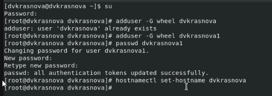
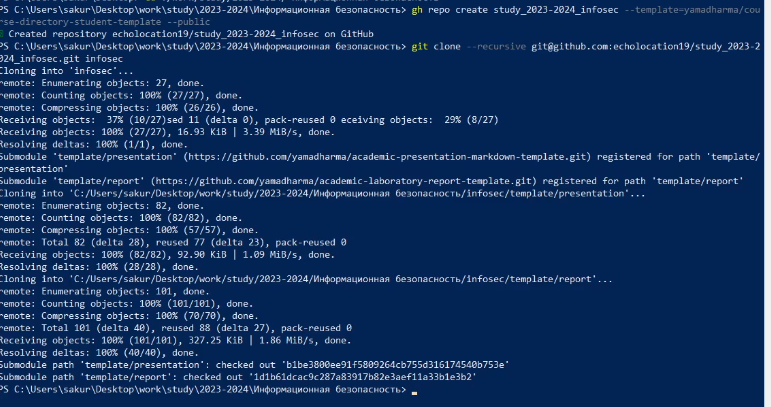

---
## Front matter
lang: ru-RU
title: Структура научной презентации
subtitle: Простейший шаблон
author:
  - Краснова Д.В
institute:
  - Российский университет дружбы народов, Москва, Россия
date: 09 сентября 2023

## i18n babel
babel-lang: russian
babel-otherlangs: english

## Formatting pdf
toc: false
toc-title: Содержание
slide_level: 2
aspectratio: 169
section-titles: true
theme: metropolis
header-includes:
 - \metroset{progressbar=frametitle,sectionpage=progressbar,numbering=fraction}
 - '\makeatletter'
 - '\beamer@ignorenonframefalse'
 - '\makeatother'
---

# Информация

# Вводная часть

## Цели и задачи

::: incremental

Целью данной работы является приобретение практических навыков
установки операционной системы на виртуальную машину, настройки ми-
нимально необходимых для дальнейшей работы сервисов.

:::

# Выполнение задания

::: incremental

Установка на виртуальную машину VirtualBox дистрибутива Rocky

Показан вызов терминала в rocky linux

{#fig:001 width=70%}

:::

# Настройка github
::: incremental

{#fig:002 width=70%}

{#fig:003 width=70%}

:::

# Вывод

Я приобрела практические навыки установки операционной системы на виртуальную машину, настройки ми нимально необходимых для дальнейшей работы сервисов

