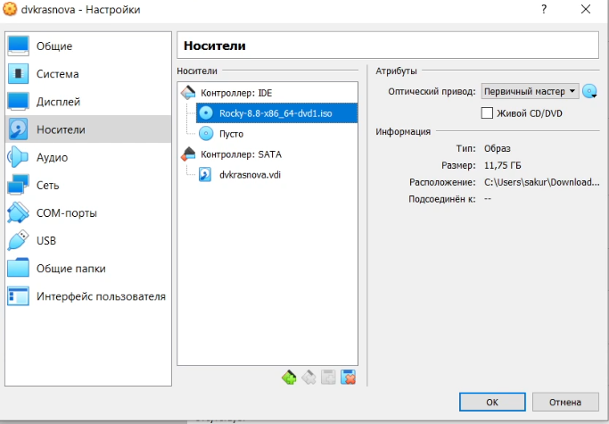

---
## Front matter
title: "Шаблон отчёта по лабораторной работе №1"
author: "Краснова Диана Владимировна"

## Generic otions
lang: ru-RU
toc-title: "Содержание"

## Bibliography
bibliography: bib/cite.bib
csl: pandoc/csl/gost-r-7-0-5-2008-numeric.csl

## Pdf output format
toc: true # Table of contents
toc-depth: 2
lof: true # List of figures
lot: true # List of tables
fontsize: 12pt
linestretch: 1.5
papersize: a4
documentclass: scrreprt
## I18n polyglossia
polyglossia-lang:
  name: russian
  options:
	- spelling=modern
	- babelshorthands=true
polyglossia-otherlangs:
  name: english
## I18n babel
babel-lang: russian
babel-otherlangs: english
## Fonts
mainfont: PT Serif
romanfont: PT Serif
sansfont: PT Sans
monofont: PT Mono
mainfontoptions: Ligatures=TeX
romanfontoptions: Ligatures=TeX
sansfontoptions: Ligatures=TeX,Scale=MatchLowercase
monofontoptions: Scale=MatchLowercase,Scale=0.9
## Biblatex
biblatex: true
biblio-style: "gost-numeric"
biblatexoptions:
  - parentracker=true
  - backend=biber
  - hyperref=auto
  - language=auto
  - autolang=other*
  - citestyle=gost-numeric
## Pandoc-crossref LaTeX customization
figureTitle: "Рис."
tableTitle: "Таблица"
listingTitle: "Листинг"
lofTitle: "Список иллюстраций"
lotTitle: "Список таблиц"
lolTitle: "Листинги"
## Misc options
indent: true
header-includes:
  - \usepackage{indentfirst}
  - \usepackage{float} # keep figures where there are in the text
  - \floatplacement{figure}{H} # keep figures where there are in the text
---

# Цель работы

Целью данной работы является приобретение практических навыков
установки операционной системы на виртуальную машину, настройки ми-
нимально необходимых для дальнейшей работы сервисов.

Изучить идеологию и применение средств контроля версий.
Освоить умения по работе с git.

# Задание

Установка на виртуальную машину VirtualBox дистрибутива Rocky
С помощью контроля управления версиями git загрузить в свой созданный репозиторий выполнение лабораторной работы

# Теоретическое введение

| Термин    | Описание термина                                                                              |
|-----------|-----------------------------------------------------------------------------------------------|
| `git`     | Система управления версиями                                                                   |
| `github ` | Веб вервис для хостинга проектов                                                              |
| `gh`      | Интерфейс командной строки для GitHub для использования в вашем терминале или ваших скриптах. ||

# Выполнение лабораторной работы

1. Создать локальный каталог для работы с курсом. С помощью утилиты gh создать репозиторий на основе шаблона (рис. @fig:001).

{#fig:001 width=70%}

2. Удалить лишние файлы, установить в COURSE название "infosec" (рис. @fig:002)

{#fig:002 width=70%}

3. Выполнить файл make для генерации нужных файлов и добавить их через git add . (рис. @fig:003)

{#fig:003 width=70%}

4. Закоммитить и запушить изменения в репозиторий на github (рис. @fig:004)

{#fig:004 width=70%}

5. Закоммитить и запушить изменения в репозиторий на github (рис. @fig:005)

{#fig:005 width=70%}

6. Приступить к установке дистрибутива Rocky Linux

{#fig:006 width=70%}
{#fig:007 width=70%}
{#fig:008 width=70%}

7. После запуска пройти шаги установки
{#fig:009 width=70%}
{#fig:010 width=70%}
{#fig:011 width=70%}
{#fig:012 width=70%}
{#fig:013 width=70%}
{#fig:014 width=70%}
{#fig:015 width=70%}

8. Глобально добавить нового юзера

{#fig:016 width=70%}

9. Получить информацию

Получите следующую информацию.
9.1. Версия ядра Linux (Linux version).

{#fig:018 width=70%}

9.2. Частота процессора (Detected Mhz processor).

{#fig:017 width=70%}

9.3. Модель процессора (CPU0).

{#fig:019 width=70%}

9.4. Объем доступной оперативной памяти (Memory available).

{#fig:020 width=70%}

9.5. Тип обнаруженного гипервизора (Hypervisor detected).

{#fig:021 width=70%}

9.6. Тип файловой системы корневого раздела.

{#fig:022 width=70%}

9.7. Последовательность монтирования файловых систем.

{#fig:023 width=70%}

# Выводы

Я приобрела практические навыки установки операционной системы на виртуальную машину, настройки ми нимально необходимых для дальнейшей работы сервисов

# Список литературы
1. https://rockylinux.org/
2. https://github.com/cli/cli
