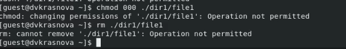

---
## Front matter
lang: ru-RU
title: Презентация по лабораторной работе №4
author:
  - Краснова Диана Владимировна
institute:
  - Российский университет дружбы народов, Москва, Россия

## i18n babel
babel-lang: russian
babel-otherlangs: english

## Formatting pdf
toc: false
toc-title: Содержание
slide_level: 2
aspectratio: 169
section-titles: true
theme: metropolis
header-includes:
 - \metroset{progressbar=frametitle,sectionpage=progressbar,numbering=fraction}
 - '\makeatletter'
 - '\beamer@ignorenonframefalse'
 - '\makeatother'
---

# Цель лабораторной работы

Получение практических навыков работы в консоли с расширенными атрибутами файлов.

# Процесс выполнения лабораторной работы

## Расширенный атрибут а

{ #fig:001 }

{ #fig:002 }

## Расширенный атрибут i

{ #fig:003 }

{ #fig:004 }

## Вывод

Получены практические навыки работы в консоли с расширенными атрибутами файлов. 