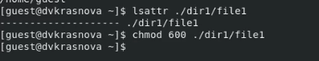
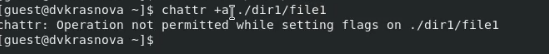
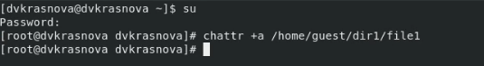

---
## Front matter
title: "Лабораторная работа №4"
author: "Краснова Диана Владимировна"

## Generic otions
lang: ru-RU
toc-title: "Содержание"

## Bibliography
bibliography: bib/cite.bib
csl: pandoc/csl/gost-r-7-0-5-2008-numeric.csl

## Pdf output format
toc: true # Table of contents
toc-depth: 2
lof: true # List of figures
lot: true # List of tables
fontsize: 12pt
linestretch: 1.5
papersize: a4
documentclass: scrreprt
## I18n polyglossia
polyglossia-lang:
  name: russian
  options:
	- spelling=modern
	- babelshorthands=true
polyglossia-otherlangs:
  name: english
## I18n babel
babel-lang: russian
babel-otherlangs: english
## Fonts
mainfont: PT Serif
romanfont: PT Serif
sansfont: PT Sans
monofont: PT Mono
mainfontoptions: Ligatures=TeX
romanfontoptions: Ligatures=TeX
sansfontoptions: Ligatures=TeX,Scale=MatchLowercase
monofontoptions: Scale=MatchLowercase,Scale=0.9
## Biblatex
biblatex: true
biblio-style: "gost-numeric"
biblatexoptions:
  - parentracker=true
  - backend=biber
  - hyperref=auto
  - language=auto
  - autolang=other*
  - citestyle=gost-numeric
## Pandoc-crossref LaTeX customization
figureTitle: "Рис."
tableTitle: "Таблица"
listingTitle: "Листинг"
lofTitle: "Список иллюстраций"
lotTitle: "Список таблиц"
lolTitle: "Листинги"
## Misc options
indent: true
header-includes:
  - \usepackage{indentfirst}
  - \usepackage{float} # keep figures where there are in the text
  - \floatplacement{figure}{H} # keep figures where there are in the text
---

# Цель работы

Получение практических навыков работы в консоли с расширенными атрибутами файлов.

# Выполнение лабораторной работы

1. От имени пользователя guest определите расширенные атрибуты файла /home/guest/dir1/file1 командой lsattr /home/guest/dir1/file1

2. Установите командой chmod 600 file1 на файл file1 права, разрешающие чтение и запись для владельца файла.

{ #fig:001 width=70% height=70%}

3. Попробуйте установить на файл /home/guest/dir1/file1 расширенный атрибут a от имени пользователя guest: chattr +a /home/guest/dir1/file1

Получаем отказ, для смены расширенных атрибутов недостаточно прав.

{ #fig:002 width=70% height=70%}

4. Зайдите на третью консоль с правами администратора либо повысьте свои права с помощью команды su. Попробуйте установить расширенный атрибут a на файл /home/guest/dir1/file1 от имени суперпользователя: chattr +a /home/guest/dir1/file1

Команда выполнилась от имени суперпользователя

{ #fig:003 width=70% height=70%}

5. От пользователя guest проверьте правильность установления атрибута: lsattr /home/guest/dir1/file1

Атрибут –а установлен.

6. Выполните дозапись в файл file1 слова «test» командой echo "test" >> /home/guest/dir1/file1

Дозапись выполнена.

После этого выполните чтение файла file1 командой cat /home/guest/dir1/file1 Файл содержит строку “test”.

{ #fig:004 width=70% height=70%}

7. Попробуйте удалить файл file1 либо стереть имеющуюся в нём информацию командой echo "abcd"  >  /home/guest/dirl/file1 Попробуйте переименовать файл.

Перезаписать файл не удается, удалить или переименовать тоже.

8. Попробуйте с помощью команды chmod 000 file1 установить на файл file1 права, например, запрещающие чтение и запись для владельца файла. Удалось ли вам успешно выполнить указанные команды?

Команда изменения прав также не выполняется.

{ #fig:005 width=70% height=70%}

9. Снимите расширенный атрибут a с файла /home/guest/dirl/file1 от имени суперпользователя командой chattr -a /home/guest/dir1/file1

Атрибут снят.

Повторите операции, которые вам ранее не удавалось выполнить. Ваши наблюдения занесите в отчёт.

После снятия атрибута –а стало возможным переписать файл, удалить или переименовать его, а также сменить права. Атрибут –а позволяет только дозаписывать файл.

{ #fig:006 width=70% height=70%}

{ #fig:007 width=70% height=70%}

10. Повторите ваши действия по шагам, заменив атрибут «a» атрибутом «i». Удалось ли вам дозаписать информацию в файл? Ваши наблюдения занесите в отчёт. 

Атрибут –i запрещает любое изменеие файла: дозапись, переименование, удаление, смену атрибутов.

{ #fig:008 width=70% height=70%}
{ #fig:008 width=70% height=70%}

# Выводы

Получены практические навыки работы в консоли с расширенными атрибутами файлов. 

# Список литературы

1. [КОМАНДА CHATTR В LINUX](https://losst.ru/neizmenyaemye-fajly-v-linux)
2. [chattr](https://en.wikipedia.org/wiki/Chattr)